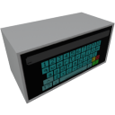

    

|Component|`Keyboard`|
|---|---|
|**Module**|`ARCHEAN_hid`|
|**Mass**|2 kg|
|[**Size**](# "Based on the component's occupancy in a fixed 25cm grid.")|50 x 25 x 25 cm|
#
---
# Description
The Keyboard is a component that provides a touch-sensitive keyboard for sending alphanumeric values to other components.

# Usage
You can enter a alphanumerical value using the touch buttons of the keyboard by pressing the `F` key, and they will be displayed on the Keyboard screen but only become effective/updated when the confirm button (green) is pressed.

The yellow button allows you to delete the last entered character, while the red button allows you to clear everything.

> - `^` Allows switching between lowercase and uppercase
> - `!?` Displays special characters
> - When the confirm button is pressed, a `1` is sent to channel 1 for 1 tick, otherwise `0` is sent.