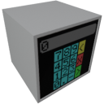

    

|Component|`Numpad`|
|---|---|
|**Module**|`ARCHEAN_hid`|
|**Mass**|1 kg|
|[**Size**](# "Based on the component's occupancy in a fixed 25cm grid.")|25 x 25 x 25 cm|
#
---
# Description
The Numpad is a component that provides a touch-sensitive numeric keypad for sending numerical values to other components.

# Usage
You can enter a numerical value using the touch buttons of the numeric keypad by pressing the `F` key, and they will be displayed on the Numpad screen but only become effective/updated when the validation button (green) is pressed.

The yellow button allows you to delete the last entered digit, while the red button allows you to clear everything.

> - If the current value is negative, you can make it positive again by pressing the `-` touch button.