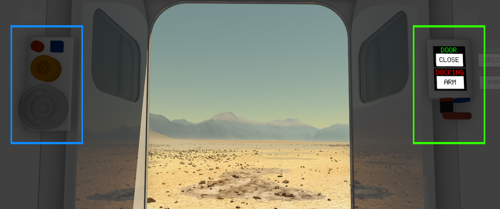

  

|Component|`DockableDoor`|
|---|---|
|**Module**|`ARCHEAN_build`|
|**Mass**|400 kg|
|[**Size**](# "Based on the component's occupancy in a fixed 25cm grid.")|250 x 250 x 100 cm|
|**Push/Pull Fluid**|Accept Push/Pull -> Forwards action to other side|
#
---

# Description
The Dockable Door is a large door that can dock to a similar door to connect two build together. Docking allows for the transfer of data, energy, and fluids between the connected build, but also constrains the two builds together in terms of physics. They are stuck together.

> - Dockable Doors can only be installed on the face of frames.
> - The Dockable Door can only be docked to another Dockable Door.
> -  *This component is related to the pressurization of builds, please refer to the [Pressurization](../../pressurization.md) page for more information.*

# Usage
To function properly, the Dockable Door needs to be powered via low voltage. It consumes 20 watts when inactive and up to 250 watts when the doors are in motion.

The interior side of the door has two panels for interacting with the door or transferring data, energy, or fluids through the docking port.

Here is an image illustrating the two panels.
- The panel in green is for interacting with the door, powering it, and controlling it remotely via a data port. (The table below indicates the inputs/outputs of the data port)
- The panel in blue is for connecting various cables that will transfer data, energy, or fluids to/from the other docked door.

### Usage with aliases
Using default aliases isn't possible for both ports simultaneously because the object will only display a single alias field in its information window (`V`). Similarly, the [router](../computers/Router.md) only displays a single alias field per component.
To separately use data ports with aliases, you need to use a [data bridge](../computers/DataBridge.md) or [data junction](../computers/DataJunction.md). This allows you to assign aliases to these objects instead of the docking ports.

### List of inputs
|Channel|Function|
|---|---|
|0|Close/Open Door|
|1|Arm/Disarm Dock|

### List of outputs
|Channel|Function|
|---|---|
|0|Door State|
|1|Dock State|
