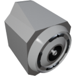

  

|Component|`DockingPort`|
|---|---|
|**Module**|`ARCHEAN_build`|
|**Mass**|50 kg|
|[**Size**](# "Based on the component's occupancy in a fixed 25cm grid.")|50 x 50 x 50 cm|
#
---

# Description
The docking port is a component that allows two builds to be connected together. The connection enables the transfer of data, energy, and fluids between the connected builds, but it also physically constrains them together. They are stuck together.

# Usage
The docking port does not need to be powered.
The separate data connector allows controlling the docking port, while the other connectors allow connecting various cables that will transfer data, energy, or fluids to/from the other docking port.

## Data Connector
The docking port has a data connector that allows it to be used from a computer, button, or any other component with a data connector.

### List of outputs
|Channel|Function|
|---|---|
|0|Is Docked

### List of inputs
|Channel|Function
|---|---|
|0|Arm/Disarm Docking
