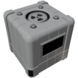

  

|Component|`FissionReactor`|
|---|---|
|**Module**|`ARCHEAN_nuclear`|
|**Mass**|1000 kg|
|[**Size**](# "Based on the component's occupancy in a fixed 25cm grid.")|275 x 275 x 275 cm|
|**Push/Pull Fluid**|Accept Push / Initiate Push|
#
---

# Description
The Fission Reactor is a component that produces heat from the nuclear fission of uranium rods.

---

# Usage

## General Operation
The reactor heats water (H₂O) using the energy generated by nuclear fission.

Water has a dual role:
- Cooling the reactor core.
- Producing steam for turbines.

---

## Required Resources
The reactor requires:
- A continuous low-voltage power supply of **1000 W**.
- A supply of cold water.
- Uranium rods placed in all 4 internal zones of the reactor.

> It is highly recommended to have at least one uranium rod per zone.  
> A reactor with empty zones will operate very poorly or not at all.

---

## Inventory and Zones
The reactor has **40 slots**, divided into **4 independent zones**.

Each zone influences its local power and temperature based on the number and type of uranium rods placed.

---

## Control Rods
Each zone has an adjustable *Control Rod*:
- 0% retracted (fully inserted) → Reaction stopped.
- 100% retracted → Maximum reaction.

---

## Reaction Startup
A manual neutron injection is required via the data port.

Up to **1000 neutrons** per second can be sent during startup
(up to **250 neutrons** per second per zone).

> - Even with uranium at 100% U235, an initial neutron supply is necessary.
> - With low-enriched uranium (10% U235), startup may require a few minutes of continuous neutron injection.

---

## Chain Reaction Behavior

Although each zone of the reactor has its own uranium rods, temperature, and neutron population, the reactor is designed to simulate a realistic chain reaction across the entire core.

- Zones are not completely isolated.
- Neutrons produced in one zone can partially spread to neighboring zones.
- This behavior improves the stability of the reaction and helps weaker zones sustain fission.

> A highly active zone can support a less active one, but having all zones properly fueled remains essential for maximum efficiency.

---

## Cooling and Steam Production
When used with *Steam Turbines*, the ideal water output temperature is **650 K**.

- Below → Reduced energy production.
- Above → Loss of efficiency (no additional gain).

> An excessively high water flow can overcool the reactor and limit the power output.

---

## Reactor States

|State|Meaning|
|---|---|
|IDLE|Reactor is off.|
|STARTING|Startup in progress (neutron injection).|
|ACTIVE|Active nuclear reaction (neutrons are being produced).|
|COOLDOWN|Cooling in progress (no neutrons produced).|
|HOT|Reactor is hot, please increase fluid flow.|
|SCRAM|Emergency shutdown triggered (Control Rods locked down to 0% retracted).|
|CRITICAL|The reactor core is severely overheating, meltdown imminent.|
|MELTDOWN|Core meltdown. Reactor unusable without manual reset.|

---

## Safety and Meltdown
- Above **1200 K** → Enters *CRITICAL* state - meltdown imminent.

In *MELTDOWN*:
- Steam flow stops - no energy can be produced.
- The reactor becomes unusable until manually reset.

### Reset Meltdown
Via the reset button in the reactor interface (key `V`).

> - In creative mode, this button is always available.  
> - In adventure mode, it's only available when the reactor has entered meltdown.

---

# Uranium Rod Wear

Uranium rods degrade slowly over time as they participate in the nuclear reaction.

### Isotope Consumption
- **U235** is gradually consumed to sustain fission.
- **U238** can also partially transform into plutonium.

### Fission Products
During operation, rods automatically accumulate fission products:
- **Xenon (Xe)**
- **Plutonium (Pu)**

These elements directly appear in the rod's composition as it ages.
> It is important to note that these fission products currently have no use in the game. To obtain plutonium for crafting the RTG, you must use the plutonium manufacturing process described on the RTG page [RTG](./RTG.md#how-to-produce-plutonium).

### Depleted Rod
When a uranium rod's **U235** concentration drops below **4.45%**, it becomes *depleted*.

> A depleted rod can no longer sustain a chain reaction, even with an external neutron supply.

### Wear Factors
The lifespan of uranium rods depends entirely on:
- Their initial U235 enrichment rate.
- The actual power produced by the reactor (thus the neutron flux).

> → The lower the enrichment and the higher the power extraction, the faster the rod will wear out.  
> → Conversely, a highly enriched uranium rod operating at moderate power can last for an extremely long time.

### List of inputs

|Channel|Function|Value|
|---|---|---|
|0|Control Rod Zone 1|0.0 to 1.0|
|1|Control Rod Zone 2|0.0 to 1.0|
|2|Control Rod Zone 3|0.0 to 1.0|
|3|Control Rod Zone 4|0.0 to 1.0|
|4|Neutrons Injection|0 to 1000|
|5|SCRAM (Emergency Shutdown)|0 or 1|

---

### List of outputs

|Channel|Function|Value|
|---|---|---|
|0|Zone 1 Temperature (Kelvin)|Number|
|1|Zone 2 Temperature (Kelvin)|Number|
|2|Zone 3 Temperature (Kelvin)|Number|
|3|Zone 4 Temperature (Kelvin)|Number|
|4|Control Rod Position Zone 1|0.0 to 1.0|
|5|Control Rod Position Zone 2|0.0 to 1.0|
|6|Control Rod Position Zone 3|0.0 to 1.0|
|7|Control Rod Position Zone 4|0.0 to 1.0|
|8|Neutron Flux Zone 1|Number|
|9|Neutron Flux Zone 2|Number|
|10|Neutron Flux Zone 3|Number|
|11|Neutron Flux Zone 4|Number|
|12|Input Water Temperature (Kelvin)|Number|
|13|Output Water Temperature (Kelvin)|Number|
|14|Water Flow Rate (kg/s)|Number|
|15|Reactor Status|"IDLE", "STARTING", "ACTIVE", "COOLDOWN", "HOT", "SCRAM", "CRITICAL", "MELTDOWN"|

---

# Uranium Rod Manufacturing

---

## Low Enriched Uranium (LEU)

|Step|Inputs|Outputs|Temperature|
|---|---|---|---|
|Crusher (Uranium Powder)|Uranium Ore : 1000 g|Uranium powder (U235 : 10%, U238 : 90%) : 1000 g|-|
|ChemicalFurnace (Yellow Cake (U₃O₈))|Uranium powder : 0.714 g, Oxygen (O₂) : 0.128 g|Yellow Cake (U₃O₈) : 0.842 g|750K - 950K|
|ChemicalFurnace (Uranium Dioxide (UO₂))|Yellow Cake (U₃O₈) : 0.842 g, Hydrogen (H₂) : 0.004 g|Uranium dioxide (UO₂) : 0.810 g, Water (H₂O) : 0.036 g|850K - 1050K|
|Crafter (Uranium Rod LEU (UO₂))|Uranium dioxide (UO₂) : 1000 g|Uranium rod LEU (UO₂, U235 : 10%, U238 : 90%) : 1|-|

---

## Highly Enriched Uranium (HEU)

### UF₆ (Gas) Production

|Step|Inputs|Outputs|Temperature|
|---|---|---|---|
|Crusher (Fluorite Powder)|Fluorite Ore: 1000 g|Fluorite powder (F₂) : 1000 g|-|
|ChemicalFurnace (Hydrogen Fluoride (HF)) *|Fluorine (F₂) : 0.038 g, Hydrogen (H₂) : 0.002 g|Hydrogen fluoride (HF) : 0.040 g|300K - 400K|
|ChemicalFurnace (Uranium Tetrafluoride (UF₄))|Hydrogen fluoride (HF) : 0.080 g, Uranium dioxide (UO₂) : 0.270 g|Uranium tetrafluoride (UF₄) : 0.314 g, Water (H₂O) : 0.036 g|750K - 950K|
|ChemicalFurnace (Uranium Hexafluoride (UF₆))|Uranium tetrafluoride (UF₄) : 0.314 g, Fluorine (F₂) : 0.038 g|Uranium hexafluoride (UF₆) : 0.352 g|550K - 750K|

* The production of Hydrogen Fluoride (HF) triggers a highly exothermic reaction. In this specific case, the resulting temperature, even if the chemical furnace displays values around 3000K, does not affect the output. However, in subsequent processes, you will need to cool down HF before it can be used, typically with an [Active Radiator](../fluids/radiator/ActiveRadiator.md) or a similar cooling device.

---

### Enrichment Centrifuge Usage

|Characteristic|Value|
|---|---|
|Power consumption|1000 W|
|Input flow|0.1 kg/s|
|Internal capacity|10 kg|

Operation:
- The first centrifuge receives uranium hexafluoride (UF₆) from the top.
- The heavy output (bottom) can be discarded as it will only contain U238.
- The lighter output can be sent to another centrifuge for further processing.

> Typically, achieving a high U235 concentration requires a chain of 8 to 10 centrifuges.

---

### Back to Solid State and Uranium Rod HEU Assembly

|Step|Inputs|Outputs|Temperature|
|---|---|---|---|
|ChemicalFurnace (Uranyl Fluoride (UO₂F₂))|Uranium hexafluoride (UF₆) : 0.352 g, Water (H₂O) : 0.036 g|Uranyl fluoride (UO₂F₂) : 0.308 g, Hydrogen fluoride (HF) : 0.080 g|300K - 350K|
|ChemicalFurnace (Uranium Dioxide (UO₂))|Uranyl fluoride (UO₂F₂) : 0.308 g, Hydrogen (H₂) : 0.002 g|Uranium dioxide (UO₂) : 0.270 g, Hydrogen fluoride (HF) : 0.040 g|750K - 850K|
|Crafter (Uranium Rod HEU (UO₂))|Enriched uranium dioxide (UO₂) : 1000 g|Uranium rod HEU (UO₂, U235 content depends on enrichment) : 1|-|
