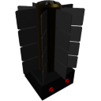

  

|Component|`RTG`|
|---|---|
|**Module**|`ARCHEAN_rtg`|
|**Mass**|50 kg|
|[**Size**](# "Based on the component's occupancy in a fixed 25cm grid.")|50 x 50 x 100 cm|
#
---

# Description
The radioisotope thermoelectric generator (RTG) generates low-voltage energy. It can provide a continuous power depending on the cooling ability of the environment.

# Usage
Connect the RTG to the component that requires low-voltage energy to function.

The RTG has two electrical ports, which allows you to connect two components simultaneously or chain multiple RTGs to increase the total power output.

### List of outputs
|Channel|Function|
|---|---|
|0|Generated Power (Watts)|
|1|Output Power (Watts)|

> - Currently, the RTG provides unlimited energy and does not have any harmful effects on the player or the environment.
>
> - If you are using the RTG to power two components, the total power distributed across the two ports cannot exceed the RTG's available output power.
>
> - If one of the two components wants to consume the entire available power from the RTG, it may prevent the other component to use any power at all. It is better to use power junctions in this case, to make sure all components get fed with power equally.

# How to produce Plutonium

## Plutonium Production Process

|Step|Inputs|Outputs|Temperature|
|---|---|---|---|
|Crusher|Uranium Ore: 1000 g|Uranium Powder (U) : 1000 g (U235 : 10%, U238 : 90%)|-|
|ChemicalFurnace (Yellow Cake - U₃O₈)|Uranium Powder (U) : 0.714 g, O₂ : 0.128 g|Yellow Cake (U₃O₈) : 0.842 g|750K - 950K|
|ChemicalFurnace (Uranium Dioxide - UO₂)|Yellow Cake (U₃O₈) : 0.842 g, H₂ : 0.004 g|Uranium Dioxide (UO₂) : 0.810 g, H₂O : 0.036 g|850K - 1050K|
|Crafter|Uranium Dioxide (UO₂) : 1000 g|Uranium Rod (U235 : 10%, U238 : 90%) : 1|-|
|Crusher|Uranium Rod|Plutonium Dioxide (PuO₂) : 1000 g (Pu : 100%)|-|
|Crafter|Plutonium Dioxide (PuO₂) : 5000 g|Plutonium Pellet : 1|-|

> It is recommended to use low-enriched uranium (LEU) for plutonium production. The enrichment level has no effect on the amount of plutonium obtained.

---

# Additional Information

In reality, processing plutonium from spent nuclear fuel is an extremely complex and demanding industrial operation, requiring advanced infrastructure and specialized facilities. For this reason, plutonium recovery and reprocessing are not currently supported in Archean.  

Instead, RTGs use a simplified form of plutonium specifically produced for energy generation. While this alternative remains easier to handle than real-world plutonium, its production is intentionally more challenging than in previous versions of the game, making RTGs less trivial to obtain while still accessible to advanced players.
