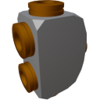

  

|Component|`HighVoltageJunction`|
|---|---|
|**Module**|`ARCHEAN_junction`|
|**Mass**|1 kg|
|[**Size**](# "Based on the component's occupancy in a fixed 25cm grid.")|25 x 25 x 25 cm|
#
---

# Description
The high voltage junction allows distributing energy to 4 ports to provide power to multiple components from a single power source.

> The high voltage junction does not allow combining energy by using it in reverse, it works in one direction only.
> The available power is effectively split based on the number of connected devices in its output ports.
