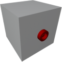

  

|Component|`LowVoltageBridge`|
|---|---|
|**Module**|`ARCHEAN_junction`|
|**Mass**|1 kg|
|[**Size**](# "Based on the component's occupancy in a fixed 25cm grid.")|25 x 25 x 25 cm|
#
---

# Description
The Low Voltage Bridge is a component that simply allows the relocation of a low voltage end point to another position.