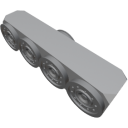

  

|Component|`FluidJunction`|
|---|---|
|**Module**|`ARCHEAN_junction`|
|**Mass**|20 kg|
|[**Size**](# "Based on the component's occupancy in a fixed 25cm grid.")|25 x 25 x 100 cm|
#
---

# Description
The Fluid Junction is a component that allows for the separation or combination of fluids.

# Usage
The Fluid Junction transfers fluids with the logic shown in the example image below. The ports on the face that contains 4 ports only communicate with the port on the face that contains only one.

When fluid enters through the bottom port, it is divided based on the number of connected components on the top.

  

