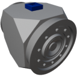

  

|Component|`FluidValve`|
|---|---|
|**Module**|`ARCHEAN_junction`|
|**Mass**|1 kg|
|[**Size**](# "Based on the component's occupancy in a fixed 25cm grid.")|25 x 25 x 25 cm|
|**Push/Pull Fluid**|accept Push/Pull -> forwards action to other side|
#
---

# Description
The fluid valve is a component that allows control of the flow of fluid passing through it.

# Usage
By default, the valve is closed and blocks the fluid from passing through. To control the fluid flow, send a data signal between `0 (Closed)` and `1 (Open)`.