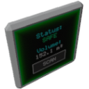

  

|Component|`Volume`|
|---|---|
|**Module**|`ARCHEAN_build`|
|**Mass**|1 kg|
|[**Size**](# "Based on the component's occupancy in a fixed 25cm grid.")|25 x 50 x 50 cm|
#
---

# Description
The Volume component, when integrated into a build, automatically calculates and delineates the volume of the area where it is positioned. This functionality can be used to:
- Create custom-shaped fuel tanks.
- Ensure the pressurization of a cabin for specific environments, such as a submarine, rocket...
- Design airships...
- ...

> <strong> This component is related to the pressurization of builds, please refer to the [Pressurization](../../pressurization.md) page for more information.</strong>

# Usage
The Volume is a simple component to use, requiring no special configuration. Just add it to a build and click the `Scan` button to automatically identify the volume of the sealed area in which it is located. It is important to note that it will only determine the volume of the area it is in, not the entire build. You will need to place as many Volume components as there are areas to pressurize.

This component can display two states depending on the tightness of the area:
- `Airtight`: If the volume is completely sealed, the state turns green to indicate that the area is airtight.
- `Leak`: If the volume is not or is no longer sealed, the state turns red to indicate that the area is not airtight.

The Volume screen only displays the volume of the sealed area in cubic meters (m³). For more detailed information, you can access its information window by pressing the `V` key. The available data includes:
- Volume capacity (m³): The total capacity of the sealed volume.
- Contents Mass (kg): The total mass of the contents present in the volume.
- Pressure (kPa): The pressure inside the sealed area.
- Liquid Level (%): The percentage of liquid fill.
- Composition: The distribution of different fluids as normalized percentages.

In Creative mode, additional buttons appear to allow filling or emptying the volume.

### List of outputs
|Channel|Function|Value|
|---|---|---|
|0|Level|0 to 1|
|1|volume (m³)|number|
|2|State|text|

