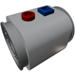

  

|Component|`FluidPump`|
|---|---|
|**Module**|`ARCHEAN_thruster`|
|**Mass**|10 kg|
|[**Size**](# "Based on the component's occupancy in a fixed 25cm grid.")|25 x 25 x 25 cm|
|**Push/Pull Fluid**|Initiate Push/Pull|
#
---

# Description
The Fluid Pump is a component used to transfer fluid up to 1 kg per second. Unlike turbo pumps, it operates on low-voltage power and reacts instantly to control inputs, allowing for highly responsive fluid management.

# Usage
## Power Supply
To use the pump, it needs to be powered by low-voltage. It consumes up to 1 kW when running at full speed.

## Data
The data port allows controlling the pump speed by sending a value between `-1` and `1`.  
When the pump is connected to a computer, it can also retrieve the current flow rate.

> When sending a negative value, the pump will effectively run in reverse.
