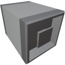

  

|Component|`ItemBridge`|
|---|---|
|**Module**|`ARCHEAN_junction`|
|**Mass**|1 kg|
|[**Size**](# "Based on the component's occupancy in a fixed 25cm grid.")|25 x 25 x 25 cm|
|**Push/Pull Item**|Accept Push/Pull -> Forwards action to other side|
#
---
# Description

The Item Bridge is a component that simply allows the relocation of an item end point to another position.