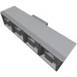

  

|Component|`ItemJunction`|
|---|---|
|**Module**|`ARCHEAN_junction`|
|**Mass**|20 kg|
|[**Size**](# "Based on the component's occupancy in a fixed 25cm grid.")|25 x 25 x 100 cm|
#
---
# Description
The item Junction is a component that allows for the distribution or aggregation of items.
Will not affect stacking.

# Usage
The item Junction transfers items with the logic shown in the example image below. The ports on the face that contains 4 ports only communicate with the port on the face that contains only one.

When items enter through the bottom port of this component, they use round robin logic to distribute.

  

