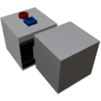

  

|Component|`LinearTrack`|
|---|---|
|**Module**|`ARCHEAN_build`|
|**Mass**|10 kg|
|[**Size**](# "Based on the component's occupancy in a fixed 25cm grid.")|25 x 25 x 50 cm|
#
---

# Description
The Linear Track is a component that includes a buildable moving block. It is designed to allow linear translation of objects on a build. It can only Translate along a track automatically created on the movement axis of the block.

>  *This component is related to the pressurization of builds, please refer to the [Pressurization](../../pressurization.md) page for more information.*

# Usage
The Linear Track can operate in two modes: Servo (default) and Velocity. To switch between modes, press the V key to open the component's information interface.

In this interface, there are additional configurations possible:
- `Max Speed` which determines the maximum speed in meters per second.
- `Acceleration` which determines the rate at which the linear track will accelerate to reach its Max Speed.
- `Override limits` when enabled, allows you to manually set the minimum and maximum position limits instead of using the automatically calculated values based on available track space.

## Tracks
The tracks for the Linear Track component are automatically created and updated along its axis. They are created on top of normal blocks of any type. To end the track the line has to be broken. For example with another block on top or by leaving a hole along the track.

## Servo Mode
In servo mode, the device rotates to a precise position determined by the data received through its data port. It accepts all values and will react accordingly in the range between min and max. So if a number greater or smaller is received it will move into the according min/max position.

## Velocity Mode
In velocity mode, the device operates continuously in the direction indicated by the data from its port, accepting values between `-1.0` to `+1.0` to determine its speed and moving direction. `1.0` means Max Speed.

> - Builds installed on a moving part cannot collide with a parent or sibling build. They can only collide with the terrain or other separate builds.
> - To destroy the Linear Track, you must absolutely remove all the child blocks/components it contains.
> - The Linear Track has a maximum travel range of -250m to +250m (500m total).

### List of outputs
|Channel|Function|Value|
|---|---|---|
|0|Position|meters|
|1|Speed|m/s|
|2|Minimum Position|meters|
|3|Maximum Position|meters|

