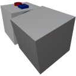

  

|Component|`SmallPivot`|
|---|---|
|**Module**|`ARCHEAN_build`|
|**Mass**|10 kg|
|[**Size**](# "Based on the component's occupancy in a fixed 25cm grid.")|25 x 25 x 50 cm|
#
---

# Description
The Small Pivot is a component that includes a buildable rotating block. It is designed to allow rotation of objects on a build.

# Usage
The Small Pivot can operate in two modes: Servo (default) and Velocity. To switch between modes, press the V key to open the component's information interface.

In this interface, there are two additional configurations possible:
- `Max Rotation Speed` which determines the maximum rotation speed in rotations per second.
- `Acceleration` which determines the rate (in rotations per second per second) at which the pivot will accelerate to reach its Max Rotation Speed.

## Servo Mode
In servo mode, the device rotates to a precise position determined by the data received through its data port. It accepts normalized values between `-1.0` and `+1.0`, which correspond to rotations of `-360°` and `+360°`. This effectively means that the values `0.0`, `-1.0` and `+1.0` will result in the same servo position.

## Velocity Mode
In velocity mode, the device operates continuously in the direction indicated by the data from its port, accepting values between `-1.0` to `+1.0` to determine it's speed and rotation direction. `1.0` means Max Rotation Speed.

> Builds installed on a moving part cannot collide with a parent or sibling build. They can only collide with the terrain or other separate builds.

### List of outputs
|Channel|Function|Value|
|---|---|---|
|0|Angle|0 to 1|
|1|Speed|rot/s| 

