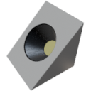

  

|Component|`SlopeLight`|
|---|---|
|**Module**|`ARCHEAN_light`|
|**Mass**|1 kg|
|[**Size**](# "Based on the component's occupancy in a fixed 25cm grid.")|25 x 25 x 25 cm|
#
---
# Description
The SlopeLight is a compact lighting component that emits light at a 45° angle.

# Usage
The SlopeLight must be powered by low voltage and consumes up to 1000 W depending on the power set in its information menu accessible via the `V` key.

The color and angle of the light can be configured via the information menu (`V` key) or via its data port.

### List of inputs
|Channel|Function|Range|
|---|---|---|
|0|Off/On|0 or 1|
|1|Red|0 to 255|
|2|Green|0 to 255|
|3|Blue|0 to 255|

### V key configuration
- **Max Power**: Adjustable from 0 to 1000 W (default: 200 W)
- **Angle**: Adjustable from 20° to 120°
- **RGB**: Color picker for the light color
