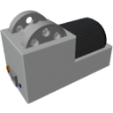

  

|Component|`Crusher`|
|---|---|
|**Module**|`ARCHEAN_machines`|
|**Mass**|400 kg|
|[**Size**](# "Based on the component's occupancy in a fixed 25cm grid.")|100 x 100 x 200 cm|
|**Push/Pull Item**|Accept Push, Initiate Push|
#
---

# Description
The Crusher is a component that allows for the rapid crushing of rocks to obtain ores.

# Usage
The Crusher requires high voltage power and consumes 10 kW.

To use the Crusher, simply send rocks to be crushed through its item input port. It will not pull from its input but it is capable of pushing the obtained ores into any container that accepts items.

The Crusher is capable of instantly crushing items as it receives them.

> When the composition of rocks contains a low concentration of certain ores, the Crusher will accumulate the ores at a low concentration until it is possible to produce at least one unit of the ore.
