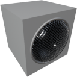

  

|Component|`Buzzer`|
|---|---|
|**Module**|`ARCHEAN_beep`|
|**Mass**|5 kg|
|[**Size**](# "Based on the component's occupancy in a fixed 25cm grid.")|25 x 25 x 25 cm|
#
---

# Description
The buzzer is a component that allows you to produce sound tones of type `sine`, `square`, `triangle`, or `sawtooth` while allowing you to control the frequency and amplitude of the sound.

# Usage
### Changing the tone type
The tone can be changed through the buzzer's configuration interface accessible with the `V` key.

### List of inputs
|Channel|Function|Value|
|---|---|---|
|0|Amplitude|0 to 1|
|1|Frequency (Hz)|0 to 20000 (default: 440Hz)|

> - To play multiple frequencies simultaneously or multiple tones, you must use multiple buzzers.