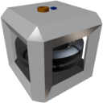

  
  

|Component|`SmallGyroscope`| `Gyroscope`|
|---|---|---|
|**Module**|`ARCHEAN_gyroscope`|`ARCHEAN_gyroscope`|
|**Mass**|50 kg|200 kg|
|[**Size**](# "Based on the component's occupancy in a fixed 25cm grid.")|50 x 50 x 50 cm|100 x 100 x 100 cm|
#
---

# Description
The gyroscope is a component that, when powered and active, dampen its angular velocity. It is mainly used to stabilize a vehicle or stop angular momentum in zero G.

# Power Supply
The gyroscope must be powered via either low voltage or high voltage. It consumes more power at startup then gradually reduces its consumption as it reaches the rotation speed you have requested via the data port.

# Usage
To start the gyroscope, it must receive a value between `0.0` and `1.0` in its data port to decrease/increase its rotation speed, thereby increasing its stabilizing effect.

The gyroscope allows for manually orienting a vehicle through its data port by harnessing the induced torque of the inertial wheels inside it. It will act based on its orientation and rotation speed.

>A gyroscope has a limited effect relative to the weight of the build. You can increase the number of gyroscopes to increase the stabilizing effect.