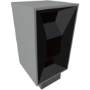

<p align="center">
  
</p>

|Component|`TerrainScanner`|
|---|---|
|**Module**|`ARCHEAN_celestial`|
|**Mass**|5 kg|
|[**Size**](# "Based on the component's occupancy in a fixed 25cm grid.")|50 x 25 x 25 cm|
#
---

# Description
The terrain scanner is a component that allows you to retrieve the altitude of the terrain at one or more positions (by distance) in the direction of its sensor. It only works on planets and moons.

# Usage
From a technical point of view, the scanner is very simple. You send it a number in channel 0 that corresponds to the distance in meters at which you want to scan the terrain, and the scanner will return a number corresponding to the altitude at that distance in the direction of the sensor.

Its strength lies in the ability to send it multiple distances in different channels to scan multiple points simultaneously on each server tick (25 times per second by default).

## Example
To scan the terrain at a distance of 10m, you need to send the value 10 in input channel 0. The scanner will return a number that corresponds to the altitude at 10m distance in the corresponding output channel.

To scan the terrain at distances of 10m and 20m, you need to send the value 10 in input channel 0 and the value 20 in input channel 1, for example. The scanner will then return a number that corresponds to the altitude at 10m distance in output channel 0 and another number for 20m distance in output channel 1.

With these possibilities, you can, for example, use a XenonCode loop to scan all altitudes within a range of 100m with a step of 10m and display them in the console.

```xc
    repeat 10 ($i)
        output_number($scanner_io, $i, $i*10)
        print(input_number($scanner_io, $i))
```

Keep in mind that there will be a 1 tick delay between sending to the output and retrieving from the input.
Basically, the Scanner will give you the results based on the values you sent it in the previous tick, so don't shuffle your distance values between channels and don't use any random values, try to keep them consistent accross multiple ticks.

## Go further
The terrain scanner scans the terrain in the direction of its sensor. You can install it on a small pivot to, for example, rotate it and create an altitude map around its position using a XenonCode program and the in-game screens.

## Energy
The terrain scanner consumes low voltage energy to function. Its consumption is directly proportional to the number of channels you use. The more positions you scan in a single tick, the more energy you consume, which is 100 watts per channel per tick.