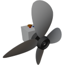

  

|Component|`Propeller`|
|---|---|
|**Module**|`ARCHEAN_propeller`|
|**Mass**|100 kg|
|[**Size**](# "Based on the component's occupancy in a fixed 25cm grid.")|50 x 50 x 50 cm|
#
---

# Description
The propeller is a component that generates thrust using rotating blades. It is used to propel vehicles in the air or in water.

# Usage

It can be configured through its configuration interface accessible via the `V` key.

### Configuration Interface
It provides information about the propeller and allows for configuration.
#### Information
- `Input Voltage`: Input voltage in volts.
- `Power`: Power consumption in Watts.
- `Thrust`: Thrust generated in Newtons.
- `Rotation Speed`: Rotation speed in rotations per second.
- `Pitch`: Normalized Pitch angle.

#### Configuration
- `Radius`: Propeller radius in meters.
- `Twist`: Propeller twist angle (normalized).
- `Blades`: Number of blades.

### Energy
The propeller has a low-voltage energy port and a high-voltage energy port, which allow for more or less control over the supplied power.
### Low-Voltage Energy
In this configuration, the propeller consumes up to 50 kw.
#### High-Voltage Energy
In this configuration, the propeller consumes up to 500 kw.

### List of inputs
|Channel|Function|Range|
|---|---|---|
|0|Speed|-1.0 to +1.0|
|1|Pitch|-1.0 to +1.0|
