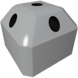

  

|Component|`RCS`|
|---|---|
|**Module**|`ARCHEAN_rcs`|
|**Mass**|10 kg|
|[**Size**](# "Based on the component's occupancy in a fixed 25cm grid.")|25 x 50 x 50 cm|
#
---

# Description
The reaction control system (RCS) consists of cold gas thrusters primarily used to control the orientation and position of a spacecraft. It is also used for fine adjustments during spacecraft docking. The RCS consists of several small thrusters that can be individually and quickly turned on/off to provide precise control.

# Usage
The RCS can be powered by various fluids, which will affect its performance depending on their density and pressure. It can be controlled by a computer or another device to adjust the thrust and direction.

It does not perform any kind of combustion.

### List of inputs
|Channel|Function|Range|
|---|---|---|
|0|Nozzle 0 (Center)|0.0 to 1.0|
|1|Nozzle 1|0.0 to 1.0|
|2|Nozzle 2|0.0 to 1.0|
|3|Nozzle 3|0.0 to 1.0|
|4|Nozzle 4|0.0 to 1.0|
