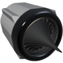

  

|Component|`BigThruster`|
|---|---|
|**Module**|`ARCHEAN_thruster`|
|**Mass**|400 kg|
|[**Size**](# "Based on the component's occupancy in a fixed 25cm grid.")|100 x 100 x 100 cm|
#
---

# Description
The big thruster generates thrust through the combustion of liquid fuel with liquid oxygen.
It can handle both CH4 (methane) and H2 (hydrogen) as its fuel.
It uses a radial aerospike nozzle and it's very efficient at converting combustion energy directly to thrust.
It can produce up to 1.8 MN of thrust from a flow rate of 100 Kg/s LOX and 12.5 Kg/s H2.

# Usage
Connect high flow oxydizer and fuel to the fluid ports, high voltage for ignition, and send 1 in the data port to ignite.

Initial ignition will only occur when the flow rate is between 1 g/s and 50 kg/s, for either the fuel or the oxydizer.

When the fuel is H2, the optimal flow ratio is 8:1 (LOX:H2) and and ratio of < 1:1 may result in a flame out (no combustion).
When the fuel is CH4, the optimal flow ratio is 4:1 (LOX:CH4) and and ratio of < 1:1 may result in a flame out (no combustion).

The igniter does not need to be kept on once combustion has begun, although it's a good idea to leave it on in case of a flame out.
Ignition consumes 1000 watts continuously when on.

The big thruster's nozzle can gimbal with a variation of -10 to +10 degrees in two axes.

### List of inputs
|Channel|Function|Range|
|---|---|---|
|0|Ignition|0 or 1|
|1|Gimbal X|-1.0 to +1.0|
|2|Gimbal Z|-1.0 to +1.0|

### List of outputs
|Channel|Function|Unit|
|---|---|---|
|0|Thrust|Newtons|
|1|Burned flow|kg/s|
|2|Unburned flow|kg/s|

> If your fuel tank is pre-mixte, you don't need to use both fluid ports.
