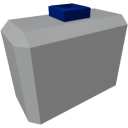

  

|Component|`AltitudeSensor`|
|---|---|
|**Module**|`ARCHEAN_sensor`|
|**Mass**|1 kg|
|[**Size**](# "Based on the component's occupancy in a fixed 25cm grid.")|25 x 25 x 25 cm|
#
---

# Description
The altitude sensor sends the altitude between the sensor's position and the ground or the center of the celestial body through its data port.

# Usage
Once placed on your build, it can be connected to a computer, for example, to retrieve the altitude in meters. The orientation of the altitude sensor has no impact on its operation.

### List of outputs
|Channel|Function|
|---|---|
|0|Absolute Altitude|
|1|Above Terrain|

>- In "Above Terrain" mode, water is not considered as terrain.
>- The altitude sensor only works in the environment of a celestial body.
