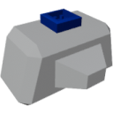

    

|Component|`AngularVelocitySensor`|
|---|---|
|**Module**|`ARCHEAN_sensor`|
|**Mass**| 1 kg|
|[**Size**](# "Based on the component's occupancy in a fixed 25cm grid.")|25 x 25 x 25 cm|
#

---

# Description
The angular velocity sensor is a component that measures the angular velocity on 3 axes (X, Y, Z) in rotations per second.

# Usage
Once placed on your construction, the sensor can be connected to a computer to retrieve the angular velocity.
The measured velocity is the velocity at the position of the sensor, not the velocity of the build.

### List of outputs
|Channel|Function|Value|
|---|---|---|
|0|Angular velocity X|rot/s|
|1|Angular velocity Y|rot/s|
|2|Angular velocity Z|rot/s|