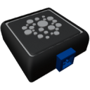

  

|Component|`DensitySensor`|
|---|---|
|**Module**|`ARCHEAN_sensor1`|
|**Mass**|1 kg|
|[**Size**](# "Based on the component's occupancy in a fixed 25cm grid.")|25 x 25 x 25 cm|
#
---

# Description
The density sensor is a component that measures the density and composition of the environment in which it is placed.

# Usage
Once placed on your build, it can be connected to a computer, for example, to retrieve the density and composition of the environment. The composition is given as a key-value string.

### List of outputs
|Channel|Function|value|
|---|---|---|
|0|Density (kg/m³)|number|
|1|Composition|text|
