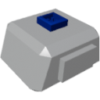

    

|Component|`LinearVelocitySensor`|
|---|---|
|**Module**|`ARCHEAN_sensor1`|
|**Mass**| 1 kg|
|[**Size**](# "Based on the component's occupancy in a fixed 25cm grid.")|25 x 25 x 25 cm|
#

#
---

# Description
The Linear Velocity Sensor is a component that measures linear velocity on 3 axes (X, Y, Z) in meters per second.

# Usage
Once placed on your build, the sensor can be connected to a computer to retrieve the linear velocity.

### List of outputs
|Channel|Function|value|
|---|---|---|
|0|Linear Velocity X|m/s|
|1|Linear Velocity Y|m/s|
|2|Linear Velocity Z|m/s|
