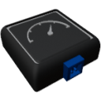

  

|Component|`SpeedSensor`|
|---|---|
|**Module**|`ARCHEAN_sensor`|
|**Mass**|1 kg|
|[**Size**](# "Based on the component's occupancy in a fixed 25cm grid.")|25 x 25 x 25 cm|
#
---

# Description
The speed sensor allows you to send the relative speed to the parent object (Planet, mothership...) through its data port.

# Usage
Once placed on your build, it can be connected to a computer, for example, to retrieve your speed in meters per second. The orientation of the speed sensor has no impact on its functionality.
