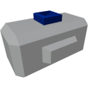

  

|Component|`TiltSensor`|
|---|---|
|**Module**|`ARCHEAN_sensor1`|
|**Mass**|1 kg|
|[**Size**](# "Based on the component's occupancy in a fixed 25cm grid.")|25 x 25 x 25 cm|
#
---

# Description
The tilt sensor allows to send through its data port the current tilt based on the horizon.

# Usage
Once placed on your build, it can be connected to a computer, for example, to retrieve your tilt between `-1.0` and `+1.0`.  
Its long axis is to be used like a level indicator.  
`-1.0` or `+1.0` means titled at 90 degrees with one end pointing perfectly downwards and one pointing perfectly upwards, while `0.0` means level with the horizon.

> Does not work in space
