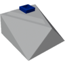

    

|Component|`VehiclePhysicsSensor`|
|---|---|
|**Module**|`ARCHEAN_sensor`|
|**Mass**| 1 kg|
|[**Size**](# "Based on the component's occupancy in a fixed 25cm grid.")|25 x 25 x 25 cm|
#

---

# Description
The Vehicle Physics Sensor is a component that provides information about the vehicle's physics state, mass, size, center of mass, and G-force.

# Usage
Once placed on your build, the sensor can be connected to a computer to retrieve information about the vehicle's physics. Here are the information you can retrieve:
- Active Physics: Indicates whether the physics is active or not.
- Mass: The mass of the vehicle in kg.
- Size (X,Y,Z): The bounding size of the vehicle in meters.
- Center of Mass (X,Y,Z): The position of the center of mass relative to the sensor's position in meters.
- G-force (X,Y,Z): The G-force relative to the sensor's position in G.

### List of Outputs
|Channel|Function|Value|
|---|---|---|
|0|Active Physics|0 or 1|
|1|Mass|kg|
|2|Size X|meters|
|3|Size Y|meters|
|4|Size Z|meters|
|5|Center of Mass X|meters|
|6|Center of Mass Y|meters|
|7|Center of Mass Z|meters|
|8|G-force X|G|
