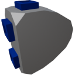

  

|Component|`DataJunction`|
|---|---|
|**Module**|`ARCHEAN_junction`|
|**Mass**|1 kg|
|[**Size**](# "Basierend auf der Belegung der Komponente in einem festen 25-cm-Raster.")|25 x 25 x 25 cm|
#
---

# Description
Die Data Junction ermöglicht die Übertragung von Daten von einem einzelnen Anschluss an vier verschiedene Anschlüsse, um Daten an mehrere Komponenten zu senden. Sie arbeitet unidirektional, daher können Sie nicht von ihr zurücklesen.
