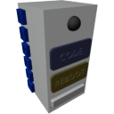

<p align="center">
  
</p>

|Component|`MiniComputer`|
|---|---|
|**Module**|`ARCHEAN_computer`|
|**Mass**|5 kg|
|[**Size**](# "Basierend auf der Belegung der Komponente in einem festen 25-cm-Raster.")|25 x 25 x 50 cm|
#
---

# Description

Der MiniComputer ist eine Komponente, die dafür konzipiert ist, XenonCode-Programme auszuführen, um andere Komponenten zu steuern.
Er ist eine kleinere Variante des [Computer](Computer.md) und verfügt über keinen eingebauten Bildschirm.

# Usage
Da er in Bezug auf Funktionen dem Computer vollständig ähnlich ist, ist seine Verwendung nahezu identisch.

Der Hauptunterschied besteht darin, dass der MiniComputer keinen eingebauten Bildschirm hat und daher kein BIOS anzeigen kann, das die verfügbaren Programme auflistet.

Wenn er nur ein Programm enthält, wird dieses automatisch geladen. Wenn Sie mehrere Programme haben möchten, müssen Sie ein benutzerdefiniertes BIOS erstellen, indem Sie eine "main.xc"-Datei anlegen, um das gewünschte Programm zu laden.

`main.xc`:
```xc
init
	load_program("rover") ; this will load the file "rover.main.xc"
```
