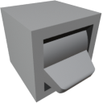

  

|Component|`ToggleButton`|
|---|---|
|**Module**|`ARCHEAN_hid`|
|**Mass**|1 kg|
|[**Size**](# "Basierend auf der Belegung der Komponente in einem festen 25-cm-Raster.")|25 x 25 x 25 cm|
#
---

# Description
Der Toggle Button sendet kontinuierlich einen Wert, wenn er aktiviert oder deaktiviert ist. Standardmäßig sendet er `1` im eingeschalteten und `0` im ausgeschalteten Zustand, aber benutzerdefinierte Werte können konfiguriert werden.

# Usage
Die `F`-Taste wird verwendet, um den Toggle Button umzuschalten.

## Configuration
Im Konfigurationsmenü, zugänglich mit der `V`-Taste:

| Option | Description |
|--------|-------------|
| **Dual-Sided** | Macht den Button von beiden Seiten bedienbar |
| **Allow IO Input** | Ermöglicht die Steuerung des Buttons von einer anderen Komponente über seinen Datenanschluss |
| **Off Value** | Der gesendete Wert, wenn der Button ausgeschaltet ist (Standard: `0`) |
| **On Value** | Der gesendete Wert, wenn der Button eingeschaltet ist (Standard: `1`) |
