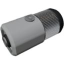

  

|Component|`SmallSteamTurbine`|
|---|---|
|**Module**|`ARCHEAN_machines`|
|**Mass**|100 kg|
|[**Size**](# "Basierend auf der Belegung der Komponente in einem festen 25-cm-Raster.")|75 x 75 x 150 cm|
|**Push/Pull Fluid**|Accept Push / Initiate Push|
#
---

# Description
Die Small Steam Turbine ist eine kompakte Version der [Steam Turbine](SteamTurbine.md), die dafür konzipiert ist, die thermische Energie von heißem Dampf in elektrische Energie umzuwandeln.

# Usage
Sie funktioniert durch Einleitung von heißem Wasserdampf in ihren Fluideingang. Je heißer der Dampf und je höher die Durchflussrate, desto mehr Energie kann sie erzeugen.

Bei voller Kapazität kann sie bis zu ungefähr **270 Kilowatt** liefern.

Wie bei jeder Dampfturbine ist ein Fluidausgangsanschluss erforderlich, um den Dampf abzuführen. Ohne diesen wird die Turbine keine Energie erzeugen.

- Minimale Betriebstemperatur: 373 K  
- Maximale effektive Temperatur: 650 K (optimaler Betrieb)  
- Maximale Durchflussrate: 1 kg/s  

Die erzeugte Energie wird direkt an einen Hochspannungs-Elektroausgang geliefert.  

Wenn die Leistung nicht vollständig verbraucht wird, umgeht sie automatisch die Turbine, um diese bei maximaler Drehzahl zu halten.
Dieser Effekt bewirkt, dass sich das Ausgangsfluid nicht so stark abkühlt.

### List of outputs
|Channel|Function|Type|
|---|---|---|
|0|Potential Energy output (watts)|number|
