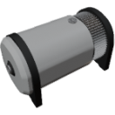

  

|Component|`SteamTurbine`|
|---|---|
|**Module**|`ARCHEAN_machines`|
|**Mass**|500 kg|
|[**Size**](# "Basierend auf der Belegung der Komponente in einem festen 25-cm-Raster.")|150 x 200 x 200 cm|
|**Push/Pull Fluid**|Accept Push / Initiate Push|
#
---

# Description
Die Steam Turbine wandelt die thermische Energie von heißem Dampf in elektrische Energie um.

# Usage
Sie funktioniert durch Einleitung von heißem Wasserdampf in ihren Fluideingang. Je heißer der Dampf und je höher die Durchflussrate, desto mehr Energie kann sie erzeugen.

Bei voller Kapazität kann sie bis zu ungefähr **27 Megawatt** liefern.

Ein Fluidausgangsanschluss ist erforderlich. Ohne diesen kann die Turbine den Dampf nicht ausstoßen und wird keine Energie erzeugen.

- Minimale Betriebstemperatur: 373 K  
- Maximale effektive Temperatur: 650 K (optimaler Betrieb)  
- Maximale Durchflussrate: 100 kg/s  

Die erzeugte Energie wird direkt an einen Hochspannungs-Elektroausgang geliefert.  

Wenn die Leistung nicht vollständig verbraucht wird, umgeht sie automatisch die Turbine, um diese bei maximaler Drehzahl zu halten.
Dieser Effekt bewirkt, dass sich das Ausgangsfluid nicht so stark abkühlt.

### List of outputs
|Channel|Function|Type|
|---|---|---|
|0|Potential Energy output (watts)|number|
