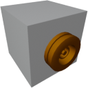

  

|Component|`HighVoltageBridge`|
|---|---|
|**Module**|`ARCHEAN_junction`|
|**Mass**|1 kg|
|[**Size**](# "Basierend auf der Belegung der Komponente in einem festen 25-cm-Raster.")|25 x 25 x 25 cm|
---
# Description
Die High Voltage Bridge ist eine Komponente, die einfach die Verlagerung eines Hochspannungs-Endpunkts an eine andere Position ermöglicht.
