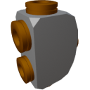

  

|Component|`HighVoltageJunction`|
|---|---|
|**Module**|`ARCHEAN_junction`|
|**Mass**|1 kg|
|[**Size**](# "Basierend auf der Belegung der Komponente in einem festen 25-cm-Raster.")|25 x 25 x 25 cm|
#
---

# Description
Die High Voltage Junction ermöglicht die Verteilung von Energie auf 4 Anschlüsse, um mehrere Komponenten von einer einzigen Stromquelle zu versorgen.

> - Die High Voltage Junction erlaubt es nicht, Energie durch umgekehrte Verwendung zu kombinieren, sie funktioniert nur in eine Richtung.
> - Die verfügbare Leistung wird dynamisch nach Bedarf verteilt, sodass Junctions frei verkettet werden können, um Komponenten nach Bedarf zu versorgen.
> - Sie können den Stromverbrauch jedes Anschlusses sowie die Eingangsleistung über das Informationsfenster überwachen, das mit der `V`-Taste zugänglich ist.
