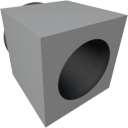

  

|Component|`FluidPort`|
|---|---|
|**Module**|`ARCHEAN_chemical`|
|**Mass**|1 kg|
|[**Size**](# "Based on the component's occupancy in a fixed 25cm grid.")|25 x 25 x 25 cm|
|**Push/Pull Fluid**|Accept Push/Pull|
#
---

# Description
Der Fluid Port ist ein Gerät, das das Ansaugen oder Ausstoßen von Fluiden ermöglicht.

>  *Diese Komponente steht im Zusammenhang mit der Druckbeaufschlagung von Builds. Weitere Informationen finden Sie auf der Seite [Pressurization](../../pressurization.md).*

Beim Ansaugen von Fluid nimmt er die Zusammensetzung der umgebenden Umwelt auf. Wenn er beispielsweise in Wasser eingetaucht ist, kann er einen Fluidtank mit H2O füllen, und wenn er sich an der freien Luft befindet, nimmt er die Zusammensetzung der Atmosphäre auf.

Beim Ausstoßen von Fluid kann er Fluidtanks von ihrem Inhalt entleeren.

# Usage
Der Fluid Port fungiert als Brücke zwischen einem Fluidbehälter und der Zusammensetzung der umgebenden Umwelt.

Für den Betrieb muss er an eine Komponente angeschlossen werden, die Fluide aufnehmen oder verarbeiten kann.

Unten ist ein Beispiel dargestellt, wie er angeschlossen werden kann.

## Flow Rate Limit

Der Fluid Port hat eine maximale Durchflussrate von **1,0 m³/s** (volumenbasiert, nicht massebasiert).

Da das Limit volumetrisch ist, hängt die tatsächlich **übertragene Masse von der Fluiddichte ab**:
- Dichte Fluide (Flüssigkeiten wie H2O, flüssiger O2) übertragen mehr Masse pro Sekunde
- Leichte Fluide (Gase, Hochatmosphäre) übertragen weniger Masse pro Sekunde
- Im Vakuum (Dichte = 0) kann nichts übertragen werden

Zum Beispiel:
- Wasser (~1000 kg/m³): bis zu 1000 kg/s
- Luft auf Meereshöhe (~1,2 kg/m³): bis zu 1,2 kg/s
- Luft in großer Höhe (~0,4 kg/m³): bis zu 0,4 kg/s

## Placement

Beim Platzieren eines Fluid Port stellen Sie sicher, dass die **Düsenöffnung in Richtung** des Bereichs zeigt, mit dem Sie interagieren möchten. Sie können ihn bündig an einer Wand montieren, wobei die Öffnung nach innen zeigt - solange die Düse in den Raum zeigt, funktioniert er korrekt.

## Information Window

Drücken Sie `V` auf einem Fluid Port, um anzuzeigen:
- **Environment density** (kg/m³): Die Dichte am Messpunkt
- **Environment Composition**: Die Fluidzusammensetzung nach Volumenprozent

Wenn sich der Messpunkt innerhalb eines druckbeaufschlagten Volumens befindet, wird der Inhalt des Volumens angezeigt. Andernfalls wird die Umgebungsumwelt angezeigt (Atmosphäre, Wasser usw.).
