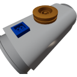

  

|Component|`SmallTurboPump`|
|---|---|
|**Module**|`ARCHEAN_thruster`|
|**Mass**|25 kg|
|[**Size**](# "Based on the component's occupancy in a fixed 25cm grid.")|25 x 25 x 50 cm|
|**Push/Pull Fluid**|Initiate Push/Pull|
#
---

# Description
Die Small Turbo Pump ist eine Komponente zum Übertragen von hochdichten Fluiden mit bis zu 10 kg pro Sekunde.

# Usage
## Power Supply
Um die Pumpe zu verwenden, muss sie mit Hochspannung versorgt werden. Sie verbraucht bis zu 10 kW bei voller Geschwindigkeit.

## Data
Der Datenport ermöglicht die Steuerung der Pumpengeschwindigkeit durch Senden eines Wertes zwischen `-1` und `1`.
Wenn die Pumpe an einen Computer angeschlossen ist, kann auch die aktuelle Durchflussrate abgerufen werden.

> Beim Senden eines negativen Wertes läuft die Pumpe effektiv rückwärts.
