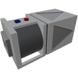

  

|Component|`ItemConveyor`|
|---|---|
|**Module**|`ARCHEAN_machines`|
|**Mass**|50 kg|
|[**Size**](# "Based on the component's occupancy in a fixed 25cm grid.")|50 x 50 x 100 cm|
|**Push/Pull Item**|Initiate Push/Pull|
#
---

# Description
Der Item Conveyor ist eine Komponente, die das Bewegen von Items von einem Punkt zu einem anderen ermöglicht. Er funktioniert, indem er Items am Eingang zieht und am Ausgang schiebt. Er kann zum Beispiel verwendet werden, um Items von einem Container zu einem anderen zu transportieren.

# Usage
Der Item Conveyor benötigt Niederspannung, wobei der Stromverbrauch direkt proportional zur Durchflussrate der bewegten Items ist.

Er kann entweder über sein Informationsfenster (zugänglich mit der `V`-Taste) oder über seinen Datenport konfiguriert werden.
Die verfügbaren Konfigurationsoptionen sind:

|Option|Value|Description|
|---|---|---|
|**Pull n items/sec**|1 to 1000|Maximale Anzahl der pro Sekunde zu bewegenden Items|
|**Pull x kg/sec**|0 to 1000 kg|Maximale Masse der pro Sekunde zu bewegenden Items|
|**Filter**|text|Ermöglicht das Whitelisting eines bestimmten Item-Typs. Wenn zum Beispiel "Wire" angegeben wird, werden nur Drähte durchgelassen|

> - Der Item Conveyor kann nur einen Item-Typ gleichzeitig filtern. Wenn Sie mehrere Item-Typen bewegen möchten, benötigen Sie mehrere Conveyors.
> - Der Filter unterscheidet zwischen Groß- und Kleinschreibung.

### List of inputs
|Channel|Function|Value|
|---|---|---|
|0|ON|0 or 1|
|1|Pull n items/second|1 to 1000|
|2|Filter|text|
|3|Pull x kg/second|0 to 1000|
