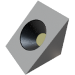

  

|Component|`SlopeLight`|
|---|---|
|**Module**|`ARCHEAN_light`|
|**Mass**|1 kg|
|[**Size**](# "Based on the component's occupancy in a fixed 25cm grid.")|25 x 25 x 25 cm|
#
---
# Description
Das SlopeLight ist eine kompakte Beleuchtungskomponente, die für die Montage auf Schrägen konzipiert ist. Es strahlt Licht mit einem Standard-Abstrahlwinkel von 120° aus.

# Usage
Das SlopeLight muss mit Niederspannung versorgt werden und verbraucht bis zu 1000 W, abhängig von der in seinem Informationsmenü eingestellten Leistung, das über die `V`-Taste zugänglich ist.

Farbe und Winkel des Lichts können über das Informationsmenü (`V`-Taste) oder über seinen Datenport konfiguriert werden.

### List of inputs
|Channel|Function|Range|
|---|---|---|
|0|Off/On|0 or 1|
|1|Red|0 to 255|
|2|Green|0 to 255|
|3|Blue|0 to 255|

### V key configuration
- **Max Power**: Einstellbar von 0 bis 1000 W (Standard: 200 W)
- **Angle**: Einstellbar von 20° bis 120°
- **RGB**: Farbwähler für die Lichtfarbe
