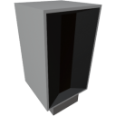

<p align="center">
  
</p>

|Component|`OreScanner`|
|---|---|
|**Module**|`ARCHEAN_celestial`|
|**Mass**|5 kg|
|[**Size**](# "Based on the component's occupancy in a fixed 25cm grid.")|50 x 25 x 25 cm|
#
---

# Description
Der Ore Scanner ist eine Komponente, die es ermöglicht, die Zusammensetzung des Terrains an einer oder mehreren Positionen (nach Entfernung) in Richtung seines Sensors abzurufen. Er funktioniert nur auf Planeten und Monden und wird hauptsächlich verwendet, um Erze für das Crafting-System zu finden.

# Usage
Technisch gesehen ist der Scanner sehr einfach. Sie senden ihm eine Zahl auf Kanal 0, die der Entfernung in Metern entspricht, in der Sie das Terrain horizontal scannen möchten, und der Scanner gibt ein Textobjekt zurück, das der Zusammensetzung an dieser Entfernung in Richtung des Sensors entspricht.

Seine Stärke liegt in der Fähigkeit, ihm mehrere Entfernungen auf verschiedenen Kanälen zu senden, um mehrere Punkte gleichzeitig bei jedem Server-Tick zu scannen (standardmäßig 25 Mal pro Sekunde).

> Richten Sie ihn niemals nach unten/oben, er funktioniert am besten beim horizontalen Scannen.

## Example
Um das Terrain in einer Entfernung von 10m zu scannen, müssen Sie den Wert 10 auf Eingangskanal 0 senden. Der Scanner gibt ein Textobjekt zurück, das der Zusammensetzung in 10m Entfernung auf dem entsprechenden Ausgangskanal entspricht.

Um das Terrain in Entfernungen von 10m und 20m zu scannen, müssen Sie den Wert 10 auf Eingangskanal 0 und den Wert 20 auf Eingangskanal 1 senden. Der Scanner gibt dann ein Textobjekt für die Zusammensetzung in 10m Entfernung auf Ausgangskanal 0 und ein weiteres Textobjekt für 20m Entfernung auf Ausgangskanal 1 zurück.

Mit diesen Möglichkeiten können Sie zum Beispiel eine XenonCode-Schleife verwenden, um alle Zusammensetzungen innerhalb einer Reichweite von 100m mit einem Schritt von 10m zu scannen und sie in der Konsole anzuzeigen.

```xc
	repeat 10 ($i)
		output_number($scanner_io, $i, $i*10)
		print(input_text($scanner_io, $i))
```

Beachten Sie, dass es eine Verzögerung von 1 Tick zwischen dem Senden an den Ausgang und dem Abrufen vom Eingang gibt.
Grundsätzlich liefert der Scanner die Ergebnisse basierend auf den Werten, die Sie ihm im vorherigen Tick gesendet haben. Verschieben Sie also Ihre Entfernungswerte nicht zwischen den Kanälen und verwenden Sie keine zufälligen Werte, sondern halten Sie sie über mehrere Ticks hinweg konsistent.

## Data retrieval
Wenn Sie einen Scan durchgeführt haben, können Sie die Zusammensetzungsinformationen abrufen, die in Form eines Key-Value-Textobjekts vorliegen.
Wenn Sie zum Beispiel das Terrain in einer Entfernung von 10m gescannt haben, können Sie ein Textobjekt in der Form `.C{0.12}.Fe{0.05}.Si{0.03}.Cu{0.80}` abrufen, was bedeutet, dass das Terrain in 10m Entfernung 12% Kohlenstoff, 5% Eisen, 3% Silizium und 80% Kupfer enthält.

Sie können dies einfach mit dem in [XenonCode](../../xenoncode/documentation.md) implementierten Key-Value-System parsen, um die gewünschten Daten abzurufen.

## Go further
Der Ore Scanner scannt das Terrain in Richtung seines Sensors. Sie können ihn auf einem Small Pivot installieren, um ihn zum Beispiel zu drehen und eine Zusammensetzungskarte um seine Position herum mit einem XenonCode-Programm und den In-Game-Bildschirmen zu erstellen.

## Energy
Der Ore Scanner verbraucht Niederspannungsenergie zum Betrieb. Sein Verbrauch ist direkt proportional zur Anzahl der verwendeten Kanäle. Je mehr Positionen Sie in einem einzelnen Tick scannen, desto mehr Energie verbrauchen Sie, nämlich 100 Watt pro Kanal pro Tick.
