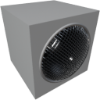

  

|Component|`Buzzer`|
|---|---|
|**Module**|`ARCHEAN_beep`|
|**Mass**|5 kg|
|[**Size**](# "Based on the component's occupancy in a fixed 25cm grid.")|25 x 25 x 25 cm|
#
---

# Description
Der Buzzer ist eine Komponente, die es ermöglicht, Klänge vom Typ `sine`, `square`, `triangle` oder `sawtooth` zu erzeugen, wobei die Frequenz und Amplitude des Klangs gesteuert werden können.

# Usage
### Ändern des Klangtyps
Der Klangtyp kann über das Konfigurationsinterface des Buzzers geändert werden, das mit der `V`-Taste zugänglich ist.

### List of inputs
|Channel|Function|Value|
|---|---|---|
|0|Amplitude|0 to 1|
|1|Frequency (Hz)|0 to 20000 (default: 440Hz)|

> - Um mehrere Frequenzen gleichzeitig oder mehrere Klänge abzuspielen, müssen Sie mehrere Buzzer verwenden.
