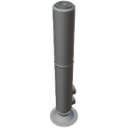

  

|Component|`EnrichmentCentrifuge`|
|---|---|
|**Module**|`ARCHEAN_chemical`|
|**Mass**|200 kg|
|[**Size**](# "Based on the component's occupancy in a fixed 25cm grid.")|75 x 75 x 275 cm|
|**Push/Pull Fluid**|Accept Push/Pull / Initiate Push/Pull|
#
---

# Description
Die Enrichment Centrifuge trennt ein Molekülgemisch in zwei unterschiedliche Ströme basierend auf ihrer Molekülmasse.

# Usage
Sie benötigt:
- Eine kontinuierliche elektrische Stromversorgung von 1.000 Watt.
- Einen Dateneingang zur Aktivierung.

Das Fluid wird über einen Port ganz oben an der Komponente eingespritzt. Unten treten die leichteren Moleküle durch einen höher positionierten Port aus, während die schwereren Moleküle durch einen niedrigeren Port direkt darunter austreten.

Beide Ausgangsports müssen ordnungsgemäß angeschlossen sein, um einen korrekten Betrieb sicherzustellen.
