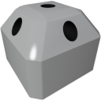

  

|Component|`RCS`|
|---|---|
|**Module**|`ARCHEAN_rcs`|
|**Mass**|10 kg|
|[**Size**](# "Based on the component's occupancy in a fixed 25cm grid.")|25 x 50 x 50 cm|
|**Push/Pull Fluid**|Accept Push|
#
---

# Description
Das Reaction Control System (RCS) besteht aus Kaltgastriebwerken, die hauptsächlich zur Steuerung der Ausrichtung und Position eines Raumfahrzeugs verwendet werden. Es wird auch für Feineinstellungen beim Andocken von Raumfahrzeugen verwendet. Das RCS besteht aus mehreren kleinen Triebwerken, die einzeln und schnell ein-/ausgeschaltet werden können, um eine präzise Steuerung zu ermöglichen.

# Usage
Das RCS kann mit verschiedenen Fluiden betrieben werden, die seine Leistung je nach Dichte und Druck beeinflussen. Es kann von einem Computer oder einem anderen Gerät gesteuert werden, um Schub und Richtung anzupassen.

Es findet keine Art von Verbrennung statt.

### List of inputs
|Channel|Function|Range|
|---|---|---|
|0|Nozzle 0 (Center)|0.0 to 1.0|
|1|Nozzle 1|0.0 to 1.0|
|2|Nozzle 2|0.0 to 1.0|
|3|Nozzle 3|0.0 to 1.0|
|4|Nozzle 4|0.0 to 1.0|
