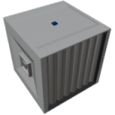

  

|Component|`SmallContainer`|
|---|---|
|**Module**|`ARCHEAN_storage`|
|**Mass**|50 kg|
|[**Size**](# "Based on the component's occupancy in a fixed 25cm grid.")|100 x 100 x 100 cm|
|**Push/Pull Item**|Accept Push/Pull|
#
---

# Description
Der Small Container ist eine Lagerkomponente mit einer Kapazität von 25 Slots.
Er ist mit zwei Ports zum Anschließen von Item-Leitungen ausgestattet, um Items zu empfangen oder zu senden.

Der Datenport ermöglicht das Abrufen des Containerinhalts als String unter Verwendung des [Key-Value-Systems](/xenoncode/documentation.md#key-value-objects).

>- *Der Container hat nicht die Fähigkeit, Items direkt über seine Ports zu ziehen oder zu schieben, er ist ausschließlich eine Lagerkomponente.*

