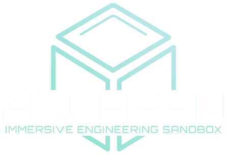

<p align="center">
  
</p>

Das **Archean Wiki** ist eine hilfreiche Ressource für alle, die tiefer in das Spiel eintauchen möchten. Es bietet Informationen zu jeder Komponente und allen verfügbaren Spielmechaniken.

> - <font color="red">Diese Dokumentation befindet sich noch in Entwicklung. Kontaktiere uns gerne, wenn du Fragen oder Vorschläge hast.</font>
> - Hilf uns, diese Dokumentation zu verbessern, indem du einen Pull Request in unserem [GitHub-Repository](https://github.com/batcholi/Archean_wiki) einreichst.


---

## Spielübersicht
**Archean** lädt dich ein, allein oder mit Freunden deine Kreativität in einem kreativen Sandbox-Modus zu entfalten.
Entwirf und baue Fahrzeuge, Basen, Raketen, Raumstationen und vieles mehr mit anpassbaren modularen Blöcken.
Erstelle einzigartige Konfigurationen mit Komponenten, programmiere ihr Verhalten und erkunde eine Umgebung ohne Einschränkungen.
Teste deine Konstruktionen, verfeinere deine Designs und trotze den Gesetzen der Physik.
Archean ist ein Spiel in Entwicklung mit Fokus auf Engineering und Bauen.


## Hauptmerkmale
```
- Fortschrittliches Engineering-System
Baue Bodenbasen, Rover, Raumfahrzeuge, Raumstationen, Mutterschiffe, Flugzeuge... verwalte ihre Systeme, Energie, Treibstoff, Elektronik...

- Offene Welt
Mach was du willst, du wirst in keinen bestimmten Weg gezwungen.

- Weltraumsimulation
Dies ist auch eine realistische Weltraumsimulation mit Orbitalmechanik, korrekter Weltraumphysik und nahtlosen Übergängen zwischen Planeten.

- Solo oder Mehrspieler
Spiele und baue allein, mit deinen Freunden oder auf öffentlichen Servern.

- Ray-Tracing
Unser Renderer ist vollständig raytraced und nutzt moderne RTX-Technologien.

- Ego-Perspektive
Dieses Spiel ist auf Immersion ausgelegt, die optionale Third-Person-Ansicht funktioniert gut, ist aber hauptsächlich für Screenshots gedacht.

- Creative-Modus
Baue alles, was du dir vorstellen kannst, mit unbegrenzten Ressourcen. Ein Survival-Modus ist für die Zukunft geplant.

- Schiffsinnenräume
Natürlich, du hast es entworfen und gebaut. Bitte mach es hübsch!

- Frei beweglich überall
Laufe in deinem Schiff herum, auf der Oberfläche von Planeten oder schwebe im Weltraum.

- Realistische Aerodynamik
Aerodynamische Kräfte werden realistisch basierend auf der Form deiner Konstruktion simuliert.

- Realistische Planetengrößen und -entfernungen
Du wirst niemals die gesamte "Karte" erkunden können.

- Echtzeit-Orbitalmechanik
Planeten und Monde umkreisen einander und du kannst sie mit realistischen Geschwindigkeiten umkreisen, sogar während du an das Schiff deines Freundes angedockt bist.

- Realistische Gravitationssimulation
Künstliche Schwerkraft gewünscht? Du kannst konstante Beschleunigung oder Zentrifugalkräfte nutzen... übergib dich nur nicht in deinen Helm.

- Reisegeschwindigkeiten bis zu 0,99 C
Hohe relativistische Geschwindigkeiten, keine künstlichen Limits, beschleunige einfach weiter... aber vergiss nicht, vor dem Aufprall auf einen Planeten abzubremsen.

- Serverbezogene Konfiguration
Jeder Server erstellt seine eigenen Regeln, Sternensysteme und aktivierten Mods.

- Detailliertes prozedurales Planetenterrain
Hochauflösendes Terrain mit vollständig prozeduralen Felsen.

- Wasser und Ozeane
Du willst ein Boot oder ein U-Boot bauen? Klar, warum nicht!?

- Programmierung im Spiel
Unsere eigene Programmiersprache im Spiel und ein spielerfreundlicheres Node-basiertes visuelles Programmiersystem.

- Standardmäßig moddbar
Wenn du gut in C++ bist, werden wir bald ein SDK bereitstellen, mit dem alles möglich ist.

```
