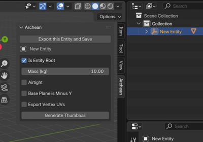

# 3D-Modellierung mit Blender

## Plugin-Installation

Hier sind zwei Möglichkeiten, das Plugin in Blender zu installieren.

### Methode 1: Aus ZIP installieren

1. Gehe zum Plugin-Repository [Archean Blender Plugin](https://github.com/batcholi/archean_blender_plugin)
2. Klicke auf den grünen "Code"-Button und wähle "Download ZIP"
3. Öffne Blender
4. Gehe in Blender zu Edit > Preferences > Add-ons
5. Wähle "Install from Disk" und dann die heruntergeladene ZIP-Datei

   
6. Aktiviere nach Abschluss der Installation das Plugin in der Add-ons-Liste.

### Methode 2: Durch Klonen des Repositorys installieren
1. Öffne ein Terminal auf deinem System.
2. Klone das Plugin-Repository in den Add-ons-Ordner von Blender:
   ```bash
   git clone https://github.com/batcholi/archean_blender_plugin <addons_path>
   ```
3. Starte Blender und überprüfe, ob das Plugin in der Add-ons-Liste erscheint.
4. Aktiviere das Plugin bei Bedarf.

<font color="orange">Für Windows-Benutzer:</font> Installiere **Git** und verwende `Git Bash`, um das Repository zu klonen. In der Eingabeaufforderung (CMD) wird Git nicht erkannt, wenn der Pfad zur ausführbaren Datei nicht zur Umgebungsvariable hinzugefügt wurde.

---

## Plugin-Übersicht

Das Plugin fügt Blender zwei neue Elemente hinzu:
1. Im "Add"-Menü im Object-Modus einen neuen Objekttyp **Archean Entity**, der eine Grundstruktur zum Erstellen einer neuen Komponente hinzufügt.

	

2. Im Viewport erscheint ein **Archean**-Menü mit verschiedenen Einstellungen.

	

## Das Plugin verwenden

Eine Archean Entity besteht immer aus einer bestimmten Struktur. Hier sind ihre Elemente:

*Mit <font color="green">grün</font> markierte Elemente sind erforderlich, mit <font color="orange">orange</font> markierte sind optional.*
- **<font color="green">Entity Root</font>**: Das Wurzelobjekt der Entity. Es ist entscheidend für den Export und muss immer vorhanden sein.
- **<font color="green">Renderable</font>**: Ein Kindobjekt des Entity Root. Dies ist das Objekt, das im Spiel sichtbar ist. Du kannst mehrere haben, aber wir empfehlen, so wenige wie möglich beizubehalten.
- **<font color="orange">Collider</font>**: Ein Kind des Entity Root, das den Kollisionsbereich definiert. Ein Collider kann 6 bis 8 Vertices enthalten. Du kannst mehrere Collider in einer Entity platzieren, aber wir empfehlen, die Anzahl aus Leistungsgründen niedrig zu halten.
- **<font color="orange">Adapter</font>**: Ein Kind des Entity Root, normalerweise kombiniert mit einem **Single Arrow**, das Verbindungspunkte für Daten-, Strom-, Fluid- oder Item-Kabel definiert.
- **<font color="orange">Joint</font>**: Ein Kindobjekt des Entity Root, das normalerweise mit einem **Single Arrow** kombiniert wird und Gelenkpunkte definiert, um Teile der Entity durch Translation oder Rotation zu animieren. Ein Joint wird zum Elternteil jedes darin enthaltenen Objekts, einschließlich anderer Joints.
- **<font color="orange">Target</font>**: Ein Kindobjekt des Entity Root, das oft mit einem **Single Arrow** kombiniert wird und eine Position und Richtung definiert, die zum Hinzufügen von Funktionalität mit XenonCode verwendet werden kann.

### Parameterübersicht
Je nachdem, ob du den Entity Root oder eines seiner Kinder ausgewählt hast, ändert sich die Liste der verfügbaren Einstellungen.
#### Entity-Root-Menüschaltflächen
- **Export this Entity and Save**: Exportiert die Entity in den Ordner, in dem die .blend-Datei gespeichert ist, und speichert dann die Datei.
- **Generate Thumbnail**: Generiert ein Vorschaubild der Entity, das als Icon im Spiel verwendet wird.
#### Entity-Root-Parameter
- **Is Entity Root**: Aktiviere dieses Kontrollkästchen, um das Objekt als Entity Root zu markieren. Dies schaltet entityspezifische Funktionen frei.
- **Mass (kg)**: Die Masse der Entity in Kilogramm.
- **Airtight**: Definiert, ob die Entity innerhalb des Bausystems von Archean luftdicht sein wird. Beachte, dass das betrachtete Volumen das des Colliders ist, nicht das des Renderable. Wenn beim Export kein Collider vorhanden ist, erstellt das Spiel automatisch einen, der die Entity umschließt.
- **Base Plane is Minus Y**: Standardmäßig ist die Grundebene der Entity an der -Z-Achse ausgerichtet. Aktiviere dies, um sie stattdessen an der -Y-Achse auszurichten.
- **Export Vertex UVs**: Aktiviere dies, um UV-Koordinaten zu exportieren. Dies ist besonders wichtig bei der Verwendung von Bildschirmen, Texturen...

#### Kindobjekt-Menüschaltfläche
- **Create Default Materials**: Archean verwendet eine spezifische Palette für Entities, Ports und mehr. Klicke auf diese Schaltfläche, um die Standardmaterialien automatisch zu generieren.
#### Kindobjekt-Parameter
- **Is Renderable**: Markiert, dass dieses Objekt im Spiel gerendert wird. Ein Unterparameter **Export Sharp Edges** erscheint, mit dem du als "Sharp" markierte Kanten in Blender exportieren kannst, sodass sie als Drahtgitter in Hologrammen im Spiel erscheinen.
- **Is Joint**: Markiert das Objekt als Joint. Eine Liste von Unterparametern erscheint, um Rotations- und Translationsbeschränkungen zu aktivieren.
- **Is Target**: Markiert das Objekt als Target, das für Funktionalität verwendet werden kann. Position und Richtung sind je nach Verwendung relevant.
- **Is Collider**: Markiert das Objekt als Collider. Collider müssen einfach sein und zwischen 6 und 8 Vertices enthalten. Ein Unterparameter **Is Build Block** erscheint, damit der Collider auch als Baublock fungieren kann, sodass Entities oder Blöcke darauf einrasten können, während sie am Archean-Raster ausgerichtet bleiben.
- **Is Adapter**: Markiert das Objekt als Verbindungspunkt für Daten-, Strom-, Fluid- oder Item-Kabel. Ein Dropdown-Unterparameter und eine **Create Mesh**-Schaltfläche ermöglichen es dir, das Anschluss-Mesh direkt zu generieren.

> Das Archean-Entwicklungsteam verwendet normalerweise **Single Arrow**-Objekte für Adapter, Joints und Targets, da sie einfach eine Position und eine Richtung darstellen.

---

## Deine erste Entity erstellen

Der erste wichtige Schritt ist, dich im 3D-Raum richtig zu orientieren. In Archean ist die Y-Achse vorwärts/rückwärts, die X-Achse links/rechts und die Z-Achse oben/unten.


1. Öffne Blender und erstelle eine neue Szene.
2. Lösche alles, was sich aktuell in der Szene befindet (standardmäßig ein Würfel, eine Kamera und ein Licht).
3. Füge im "Add"-Menü im Object-Modus eine neue **Archean Entity** hinzu.

   Dieses Anfangsobjekt enthält einen **Entity Root** und einen einfachen Würfel, der als **Renderable** markiert ist. Der Name des Entity Root ist der Entity-Name, der für den Export und im Spiel verwendet wird.

   > Der **Entity Root**-Name darf keine Leerzeichen oder Sonderzeichen enthalten — nur alphanumerische Zeichen.
4. Skaliere den Würfel auf `0.5 x 0.5 x 0.5`, also `50 x 50 x 50 cm`, da der Standardwürfel zu groß ist. *(Das sind 2 x 2 x 2 Meter im Spiel.)*
5. Speichere das Projekt in einem Ordner, bevor du weiter machst, damit du die Entity später exportieren kannst.
   > - Speichere das Projekt in deinem Komponentenordner: `Archean/Archean-data/mods/MYVENDOR_mymod/components/MyComponentName/`
   > - Siehe [Erste Schritte](getting-started.md) für die Erstellung eines Mods und die Einrichtung dieser Ordnerstruktur.
   > - <font color="orange"> Ein Mod kann mehrere Komponenten enthalten, jeweils in einem eigenen Ordner.</font>
   > - <font color="red">/!\ Der Name des Komponentenordners muss mit dem Entity-Root-Namen übereinstimmen.</font>

### Den Datenport hinzufügen
Füge ein **Single Arrow**-Objekt auf einer Fläche des Würfels hinzu, um einen Datenport zu erstellen. Generiere sein Mesh, weise das korrekte Material zu und verbinde es mit dem Hauptobjekt, um kein separates Renderable zu erstellen. Da Ports oft Smooth Shading verwenden, wende einen "Edge Split"-Modifikator auf das Hauptobjekt an, um visuelle Artefakte zu vermeiden.

<video src="./blender-res/dataport.mp4" width="700" height="438" controls loop muted></video>

### Einen Joint zum Drehen von Suzanne hinzufügen
Füge ein **Single Arrow**-Objekt oben auf dem Würfel hinzu, um einen Gelenkpunkt zu definieren. Markiere es als **Is Joint** und aktiviere nur die Rotation um die Z-Achse. Dann mache die Kindobjekte des Joints — Suzanne (Blenders Affenkopf) und einen Zylinder als Basis — zu Kindern.

Da Suzanne sich vollständig drehen kann, setze **-360** als **Low**-Wert, **0** als **Neutral** (Standardposition) und **360** als **High**.

<video src="./blender-res/joint.mp4" width="700" height="438" controls loop muted></video>

### Einen Bildschirm hinzufügen
Erstelle für das Beispiel ein Objekt, das als Basis für den Bildschirm dient. Weise zunächst ein Material zu, das wie ein Display aussieht, dann wickle die UV ab, indem du die Bildschirmfläche auswählst, sodass sie den gesamten UV-Editor ausfüllt.

> Stelle sicher, dass **Export Vertex UVs** auf dem Entity Root aktiviert ist, damit UV-Koordinaten exportiert werden.
> Das Aussehen des Bildschirmmaterials liegt bei dir; du kannst beispielsweise eine Glasoberfläche in einen Bildschirm verwandeln.

<video src="./blender-res/screen.mp4" width="700" height="438" controls loop muted></video>

### Einen Collider hinzufügen
Füge zum Abschluss einen Collider hinzu, der den Kollisionsbereich der Entity definiert. Füge einen Würfel hinzu, skaliere ihn so, dass er die gesamte Entity umschließt, und positioniere ihn korrekt. Markiere ihn als **Is Collider** und verstecke ihn im Viewport.

<video src="./blender-res/collider.mp4" width="700" height="438" controls loop muted></video>

### Port-Verwaltung für XenonCode
Die Port-Benennung folgt einer bestimmten Konvention, um sie innerhalb von XenonCode leicht identifizierbar zu machen. So funktioniert es:
- Datenports müssen **data** heißen, im Format `data.index`, oder einfach `data`, wenn es nur einen gibt. Diese Benennung ist erforderlich, damit sie in XenonCode über `input.index` und `output.index` zugänglich sind.  
  Beispiel mit zwei Datenports: Benenne sie `data.0` und `data.1`. In XenonCode greifst du über `input.0` und `input.1` darauf zu.  
  Beispiel mit einem einzelnen Datenport: Benenne ihn einfach `data`. In XenonCode greifst du über `input.0` und `output.0` darauf zu.

- Alle anderen Porttypen (Power, Fluid, Item, etc.) haben keine besonderen Benennungsanforderungen. Ihr deklarierter Name wird direkt in XenonCode verwendet.

### Vorschaubild generieren und exportieren
Sobald alles konfiguriert ist, generiere das Vorschaubild und exportiere die Entity.
- Benenne den Entity Root korrekt um.
- Stelle sicher, dass Suzanne als Renderable markiert ist.

<video src="./blender-res/suzanne.mp4" width="700" height="438" controls loop muted></video>

## Häufig gestellte Fragen
### Warum sehe ich manchmal eine "Fix now"-Meldung im Plugin-Menü?
Objekte müssen ihre Skalierung angewendet haben, um Exportprobleme zu vermeiden. Die "Fix now"-Schaltfläche wendet die Skalierung auf alle Objekte in der Szene auf einmal an. Normalerweise kannst du die Meldung verhindern, indem du die Skalierung eines Objekts mit **Ctrl + A** anwendest und **Apply > Scale** wählst.

### Die Ausrichtung des Vorschaubilds passt mir nicht. Wie ändere ich sie?
Drehe den Entity Root, um den Bildausschnitt des Vorschaubilds zu ändern. Wir empfehlen, diese Rotation niemals anzuwenden, damit du die Entity leicht in ihre ursprüngliche Ausrichtung zurückbringen kannst. Du musst das Vorschaubild nur neu generieren, wenn sich das visuelle Erscheinungsbild ändert.

### Warum sollte ich nicht zu viele Renderables erstellen?
Die Render-Engine von Archean ist zu 100% Raytracing, daher ist die Anzahl der Vertices wenig relevant. Die Anzahl der Objekte hat jedoch einen direkten Einfluss auf die Leistung. Bedenke, dass `Anzahl der Renderables = Renderables pro Entity * Anzahl der Entities` innerhalb eines Radius von ungefähr 100 km, abhängig von der endgültigen Größe der Entity. *(Je größer die Entity, desto größer der Renderradius.)*

### Ist es besser, Text als Textur oder als Mesh anzuzeigen?
Dank Raytracing ist Mesh-Text oft performanter und sieht besser aus, da er eine höhere visuelle Qualität bietet und im Vergleich zu Texturen wenig VRAM verbraucht.

### Ich bin es gewohnt, Low-Poly-Assets für Spiele zu erstellen. Sollte ich das Gleiche für Archean tun?
Überhaupt nicht — du kannst sehr detaillierte Modelle erstellen. Raytracing liefert extrem hohe visuelle Qualität. Fun Fact: Blender wird wahrscheinlich vor Archean abstürzen. Viel Spaß mit den Vertices!

### Welche Farben verwenden die offiziellen Komponenten?
Wenn du Materialien mit **Create Default Materials** generierst, ist **Color1** das Weiß, das auf den meisten Komponenten verwendet wird, **Color2** ist das metallische Grau und **Body** ist das Schwarz. Die anderen Materialien haben selbsterklärende Namen.
