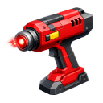

    

|Item|`DestructorTool`|
|---|---|
|**Module**|`ARCHEAN_build`|

# Description
Der Destructor ist ein Werkzeug, das es dem Spieler ermöglicht, anvisierte Komponenten zu löschen, wenn es ausgerüstet ist.

# Usage
`Rechtsklick gedrückt halten`, um den Zerstörungsmodus zu aktivieren.
`Linksklick` auf die Komponente, um sie zu zerstören.

---
>- *Du kannst mit diesem Werkzeug keine Kabel, Blöcke oder Träger zerstören.*
>- *Du kannst einen Sitz nicht löschen, wenn er von einem Spieler besetzt ist.*
>- *Wenn ein [OwnerPad](../components/miscellaneous/OwnerPad.md) hinzugefügt wurde, musst du die `Build`-Berechtigung haben, um eine Komponente zu zerstören.*
